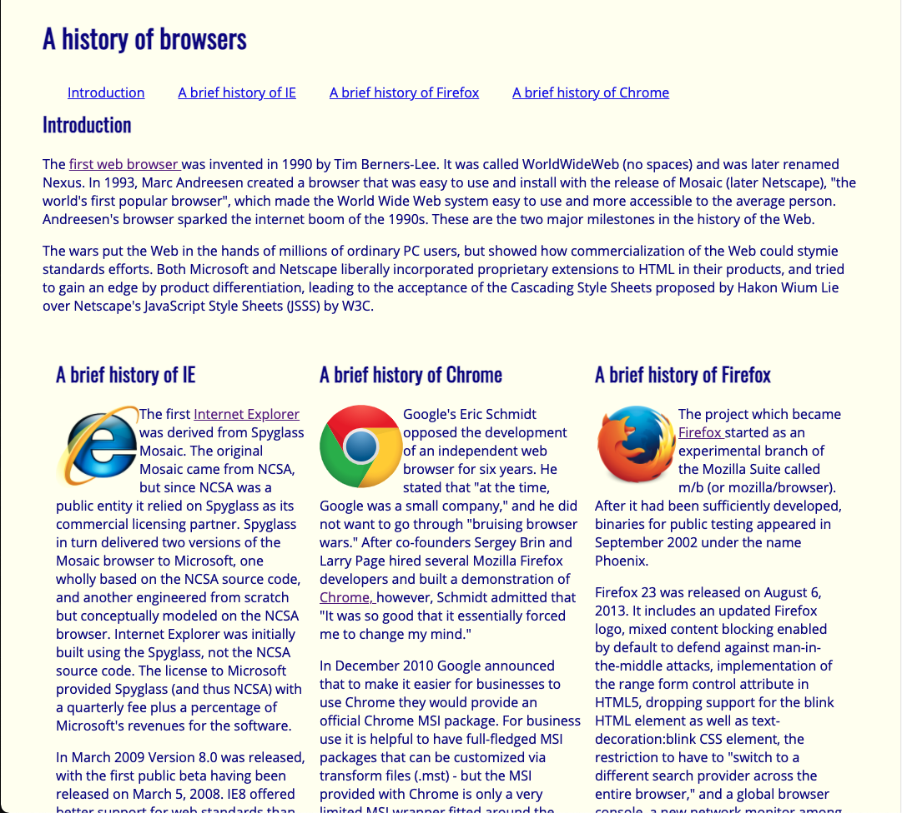

Truth be told, I don't think I could be a professional artist.  An old middle school teacher would look at my drawings as if they wanted to say: "What is this?"  Art teachers were a challenge to impress.  In high school, a girl would turn me down after I showed a "cute" little drawing of a cartoon.  Maybe to her, it wasn't so cute actually.  As I recall these memories, they were embarrassing, to say the least, and presenting the "art" here might be too much to handle. From these painful experiences, maybe art isn't particularly a strong skill of mine.  Or that was what I initially thought until the discovery of UI frameworks.  There was a sense of relief as well as glee when there is something out there that can not only streamline and simplify the designing of web pages but also save me from another artistic embarrassment. 

## The Easy Life

The websites of today are all about being presentable and stylish.  Raw HTML and CSS in their basic form simply won't cut it.  While with enough tinkering, one can certainly create something pretty.  However, to do so takes a lot of time and effort, and fortunately, I am lazy to design intricate implementations. I say fortunately because it gives me the opportunity to implement a UI framework: the means of quickly setting up a web page layout that can look visually clean and appealing.  These frameworks are the blessing of performing heavy work such as having a concise style of buttons, menus, etc.  All the necessary features that one expects on their page are simply taken care of and available at the ready.

Implementing a UI framework element can be simple as calling a div class and communicating your needs in English.  Building a three-column layout in raw HTML and CSS would require extensive tweaking of margins, paddings, and possibly CSS customizations to adjust everything properly.  Yet, in a UI framework such as [Semantic UI](https://semantic-ui.com/), words can be the only thing that is necessary to create a modern-looking web page.  A three-column layout can be simple as ```<div class="ui three column grid container>```. A navigation bar can be implemented with just ```<div class="ui four item ui menu>```. Also, if one really wanted to, a big blue button can be added with just ```<button class="ui big blue button">```.  In five words or less, one can lay out a clean presentable set of information.  In five words or less, one can lay out the ground-works of modern art.

<div class="ui two column grid container">
  <div class="column">
    <div class="ui segment">
    Raw HTML & CSS for the classic vibe</div>
  </div>
  <div class="column">
    <div class="ui segment">
    Semantic UI for the modern vibe</div>
  </div>
</div>

## Actually Not So Simple

Of course, such simplicity does present its complications in the same vein of learning pure HTML and CSS.  Simplification and ease of use are often a double edge sword.  In a framework such as Semantic UI, not everything can be described simply as big and blue upon initial disappointment.  Not all words can be applied to certain pieces of the framework; trial and error are bound to happen on what works or what doesn't work.  Additionally, there are also scripts to worry about with pieces such as dropdown menus.  For a tool kit that simplifies the creation of web page layouts, there's almost an overwhelming amount of items to comprehend.  Typically, HTML and CSS are normally described as "easy to pick up, hard to master," and UI frameworks are no exception.

Yet, just like simple HTML and CSS, UI frameworks can be satisfying to master.  Overcoming the learning curve allows one to understand all the tools available as well as make up the framework's shortcomings with proper CSS customization.  If one really wanted everything to be big and blue, they can with enough tweaking (though if we're trying to make art, maybe not everything should be big and blue).  Additionally, with enough practice, understanding a framework and all the aspects of its natural language will be just like putting a new language and its vocabulary to use.  In a field, where websites need to be quickly set up and layout, there's a payoff to learning a framework.

## The Big Picture

The layout of the webpages we create, the art we create, will always be something to keep an eye on when designing web applications.  Our technological landscape has made a focus towards the style of web pages on the tiny screens on our pockets and the screens that's the size of paper in addition to our standard laptops and desktops.  UI frameworks are the means to account for the trifecta of devices in an easy-to-pick-up implementation that results in visually pleasing websites.  They are ultimately the way to create a unified piece of art no matter the chosen method of display.  Art with the pencil and paper may have led to the occasional slips of embarrassment.  However, with UI frameworks, artistic embarrassment is something I may not have to worry about.


