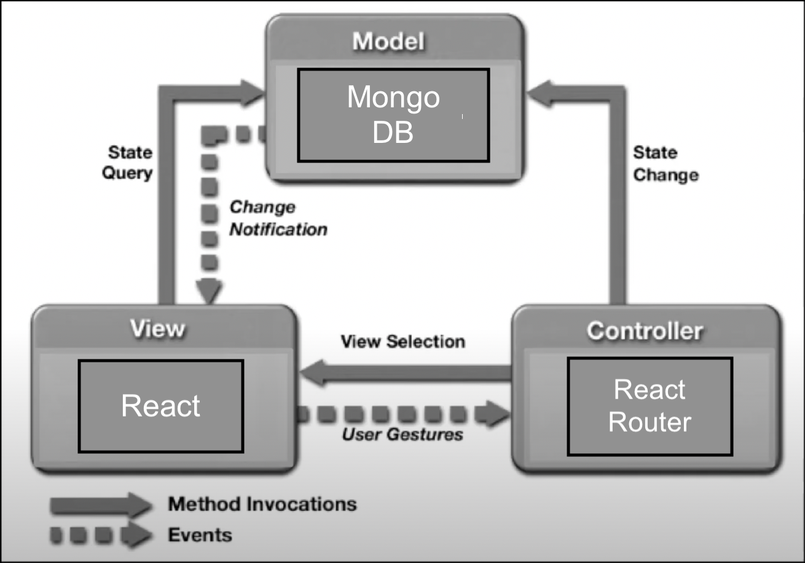

A great hero's tale usually begins with an ordinary individual that is thrust into a grand adventure to better themselves and eventually defeat an imposing villain.  Dramatic stories often present a problem that eventually leads to an ultimate climax.  With most engaging stories, there are often patterns in how these stories are told.  Heroes always go through the same journey as dramas always build to a climax. As writers often present design patterns in how their stories are told, software developers also present design patterns in how their functional applications are created.

Design patterns within software engineering are the tried and true means of creating functional software.  Being able to create something from scratch can often present many approaches on how to approach the design.  So much so that going in blind without a working plan may yield to frustration and failure.  The design patterns in software engineering solve this potential problem by providing structure on how to design applications.  Through trial and error of the software engineering field, various design patterns have been introduced such as the Model-View-Controller, Observer, Singleton, as well as many more.  Going over all of them may turn this essay into an encyclopedia, but they are the norm of how software can be implemented, and going over a few of them may be worth diving into.

## Dramatic Designs

Perhaps a prominent design pattern within software development is that of the Model-View-Controller which is heavily present in many modern frameworks.  Storytelling may often present dramatic structure that is the standard pattern to creating tension and suspense.  Similarly, the pattern of the Model-View-Controller is perhaps the standard of displaying system information in a way that is presentable to the user via views, controllers, and models, yet there are multiple ways these three pieces can interact with one another.  An application that I am currently working on called ["Easy Chef"](https://easy-chef.github.io/) allows users to create budget recipes, and part of its design includes the Model-View-Controller.  For example, a user can view a page with React that presents their created recipes to which a controller with React router manipulates the model that is MongoDB to retrieve the appropriate information where it is then presented for the user to view.   However, this is just one of many ways the Model-View-Controller pattern can be implemented.

  

    

    The flow of the Model-View-Controller

  

  

    

    The flow of dramatic stories (a.k.a Freytag's Pyramid)

  

## Observer from Afar 

In battles of good and evil, the villains are often the subject of observation to the hero. When a villain engages in their nefarious plans, such evil doings notifies the hero to engage with their adversary.  Within software development, there is a similar design pattern called the Observer.  The Observer design pattern presents two types of objects called "observers" that react accordingly based on the state of another type of object called "subjects."  This is often utilized when certain types of events have to be handled appropriately.  The Meteor framework is one type of framework that is centered around this design pattern.  More specifically, it takes on a variation of the observer design pattern called [Publish-Subscribe](https://guide.meteor.com/data-loading.html) that involves publishers who can provide messages to various subscribers.  In my own work in the "Easy Chef" application, for example, certain collections of documents get published by publishers, then when a page is requested that needs these collections (such as recipes), that is when subscribers are notified to subscribe to the appropriate collections.

## Everywhere at Once

Another design pattern worth noting is that of the Singleton pattern.  As stories can potentially tell the tales of multiple characters that all come together under one overarching story, applications can present variables that all come together within one system.  Specifically, the Singleton pattern is the means to create global variables that hold information such as a class and take them anywhere in the system where it can be utilized and presented.  An application for instance may present collections of documents in which each collection is handled by a class assigned to a global variable to which it can then be exported to pages to present the information of the class (or more specifically the collections).  In fact, this same approach is also utilized in the previously mentioned "Easy Chef" app that allows the system to handle and present certain collections within the database.

## A Tangled Weave

Yet, as stories have the potential to create an incoherent mess of characters and their journeys, a system with global variables can also leave a tangled mess.  Such cases present a different design pattern called the anti-design pattern. If not handled with care, an established design pattern such as the Singleton pattern can fall under such a category.  Even other tried and true design patterns can fall ill to being anti-design if not used in the appropriate system design.  These patterns may be tried and true but only when in the proper context will they be of benefit to the application that they are being applied to.  Yet, even anti-design patterns can be of benefit as they demonstrate what not to use under certain contexts and the looming consequences should one continue to use such patterns in an incompatible situation.

## Idle Heroes Can't Save the World

When it comes to making anything from scratch, the hardest part is actually knowing where to begin.  Given enough time, an idea may spark on where to start but such time is not always available.  At the end of the day, there's a client that expects a functional app as there are people that expect the hero to defeat the villain.  The goal has to be done eventually and sticking to tried and true solutions is often the best way to get started.  Software design patterns avoid the pitfall of being stuck when it comes to knowing where to begin.  However, what makes the design patterns of software engineering unique is that given the differing complexities of various project sizes, there's always a pattern to use due to their open-ended nature, and at times, these patterns may be used without ever being realized.  With my contributions to the "Easy Chef" project, I only realized well into the development that I have been utilizing these design patterns and yet there are many more out there to use in future projects.  The idea that design patterns can exist without being realized demonstrates how integral they are to the field of software engineering.

