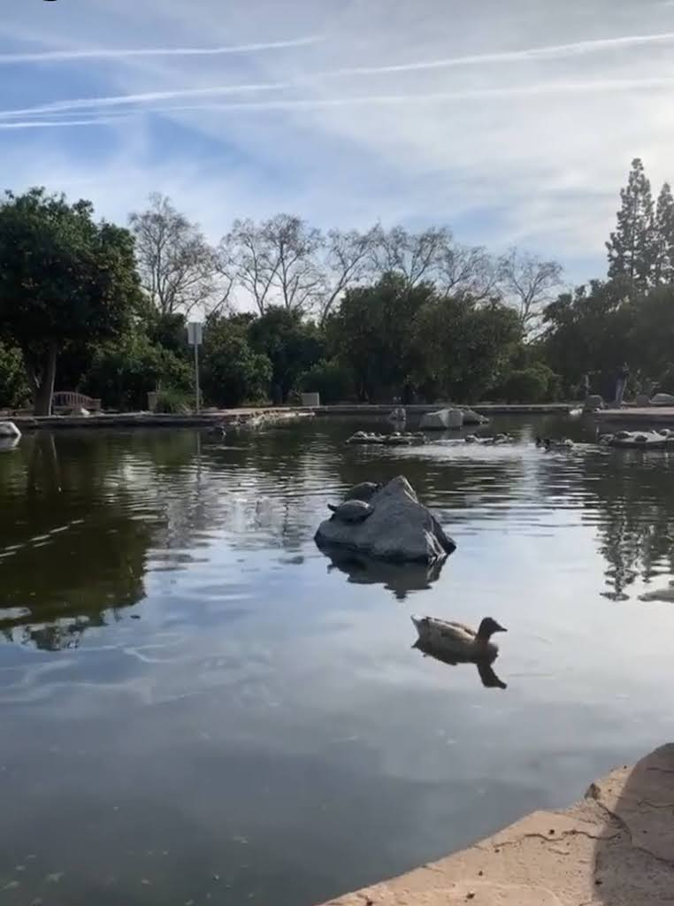

The National Student Exchange program is an experience for college students to explore and attend participating institutions across different locations across the U.S.  Normally the duration of one's exchange usually lasts for one semester, however, I decided to participate in the program for a year (Fall 2019 - Spring 2020).  The ability to attend a new university provided unique opportunities such as living in a new environment, meeting new individuals, and participating in events exclusive to the campus. 

During my time at CSU: Northridge, I was able to adjust to a different lifestyle after personally living in Hawaii for most of my life.  This adjustment allowed me to broaden my perspective of how people operate and communicate with one another in these new settings such as how  ACM @ CSUN operates slightly different than from ACM @ Manoa.  I discovered new problems that are yet to be solved in the area such as environmental issues.  However, I also discovered new opportunities to explore which included potentially working with new start-ups.  I also conversed with local companies and guest speakers who came to the campus for networking potential.  To return back to UH: Manoa with these new experiences allowed me to gain new insight about the world and the college education system that I would have otherwise not have noticed.

After my return as a full-time UH student, I also advertised this program to interested college and high school students through the means of social media as well as the creation of a video promotion.  As part of a scholarship, I try to further promote the program whenever requested by the program organizers.

For more information about NSE click [here](https://www.nse.org/).

