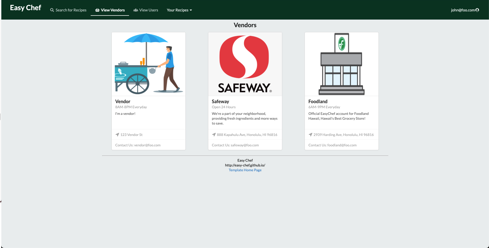

  

    

    

  

  

    

    

  

The Easy Chef project was a web application designed to serve as a final project for ICS 314 that was to encompass all the skills we learned in the class.  Easy Chef as an app was designed to be a website that allows people to sign up as a user to share recipes as well as explore and rate other recipes.  Each recipe contained information such as steps, restrictions, average rating and estimated cost.  Vendors and local stores could also sign up to share their inventory of ingredients.  A connection is made between users and vendors that allows each recipe to automatically calculate the lowest total cost of a recipe based on the inventory of all the vendors registered in the system.  This ultimately led to an app where users can discover unique recipes in the UH campus community while also being able to budget and locate affordable ingredients.

The development of this app was done in a team that consisted of Makana Lacson-Garrett, Kat Shimomura, Karen Wong, as well as myself.  To approach such a large project, we used an agile project management process called "Issue Driven Project Management" (IDPM).  This method of development involved utilizing GitHub projects to assign issues relating to certain tasks and creating branches to work independently while regrouping on a weekly basis to discuss our progress

My efforts in the development of this app were managing the deployment of the site that was available to publicly search in a web browser.  I also handled work on the creation of various collections in the Mongo database that contained documents such as recipes and profiles.  Additionally, I also handled the manipulation of the data in these documents which included designing an algorithm to automatically compute the total cost of a recipe based on ingredients in a separate collection as well as the calculation of a recipe's average rating whenever a new rating was submitted.  In addition to the work that I was assigned, I also aided my team whenever they encountered challenges that involved form creation to create recipes or the ability to search various documents.

Through the development of Easy Chef, I learned how to utilize the development tools at my disposal without guided direction and how agile project management is a key element in making the development of a large-scale app less daunting.  Without any guidance from an instructor, I was forced to learn how to think critically in terms of how to apply my knowledge regarding the tools at my disposal, ultimately allowing me to think of creative solutions to complex problems.  Being able to engage critically in these situations is thanks to management processes such as IDPM.  These processes are important as they allow a sense of direction for the team to develop an application.  In the case of IDPM, we were able to highlight key tasks at hand, assign them accordingly, and work on these tasks with minimal dependency on the work of another.  Ultimately, this experience has taught me that, by having a sound strategy and the knowledge of how to utilize the resources that are available, projects of any scale can be tacked.

To learn more about the Easy Chef app, explore our GitHub Project Page:

<a href="https://easy-chef.github.io/"><i class="large github icon "></i>Easy-Chef.github.io</a>

