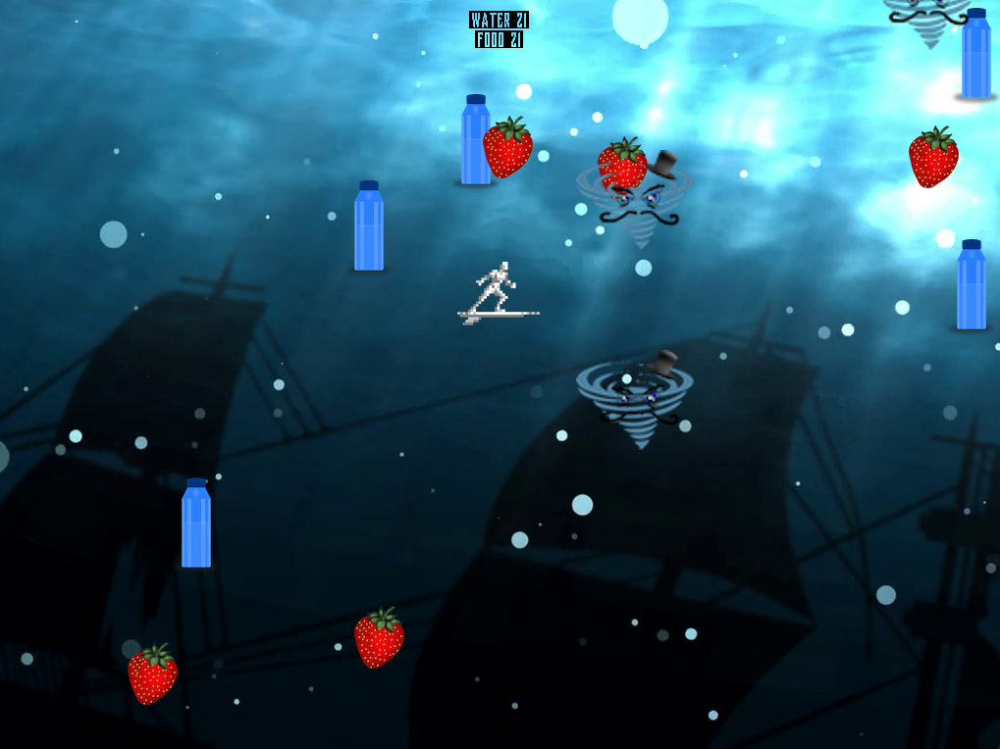

This game was one of the solo projects made as part of the ICS111 course. Using various classes and objects, the game featured a player-controlled surfer that navigates a 2D space in order to avoid tornados that posed as obstacles.  Additionally, the player also needed to collect water in order to stay alive which was another challenge for the player.  All of these items resulted in a game about obstacle navigation and resource collection.

Because this was a solo project, the code relating to the game functionality was written by me at the time of my freshman year of college.  However, the code that incorporated the ability to implement graphics and sounds belonged to the EZ multimedia library.  Also, image files and audio files that were implemented in the game were also borrowed from the internet.  By using these assets, integrating the EZ library, and writing my own code, I was able to create the final product that is the surf game.   

There were many insights gained from this project, especially as a first-year college student.  I learned to break down the project into separate pieces.  Specifically, to break down the project was to work on separate classes and objects that came together into one product.  Admittedly, the submission of this assignment was not without various faults and or bugs.  Acknowledging such mistakes, however, allowed me to learn the significance of proper time management in order to complete pieces of the project and address errors in a timely manner.  My faults with this project also demonstrated the significance of asking for assistance when no solution is clear.  After all, errors and addressing said errors are frequent in the field of program development.  My overall experience with this project nonetheless demonstrates the roots of my computer science career and serves as a reminder as to why this field is of great interest to me.

Github repo located [here.]https://github.com/joshipaino/ICS-111-Project
