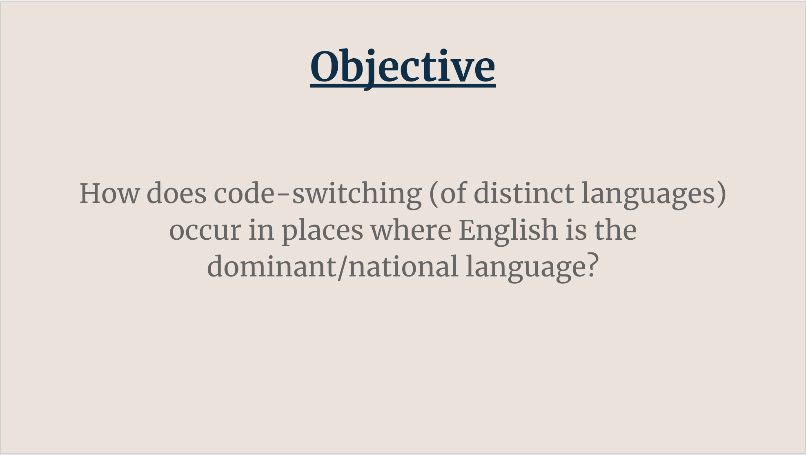
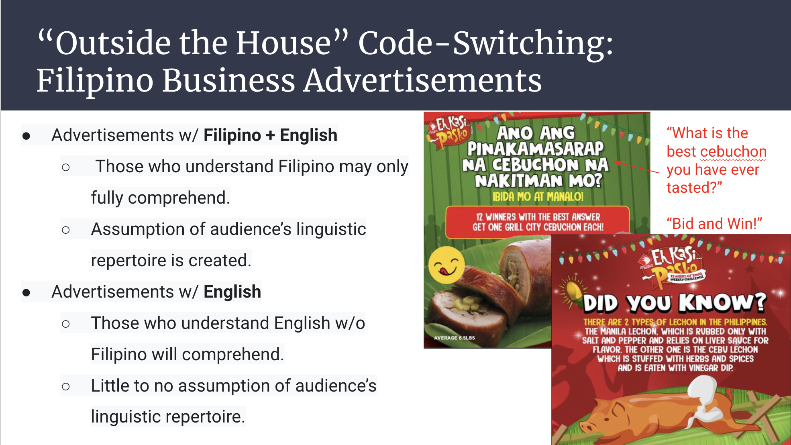

Code-Switching: The linguistic ability to communicate effectively between two distinct languages.

IP394 was a class that primarily focuses on the aspects of Filipino Linguistics.  To analyze more about this subject matter, I decided to research the presence of code-switching in a place where English is widely spoken.  I wanted to gauge if being surrounded by English has an effect on one's multilingualism.  In order to understand this idea, I had to compile various pieces of data to arrive at a conclusion.

My data analysis involved surveying individuals in Hawaii and their multilingual abilities.  Additionally, I surveyed how often the same individuals speak only English.  The collection of data was also done in the economic and public spaces in order to gauge code-switching in these types of settings.  Lastly, I also collected data from various research papers and articles that contributed some insight into the research. With all these pieces of data, I was able to compose an analysis of my findings in a research paper of my own and present it in a Powerpoint presentation. 

Through this research analysis, not only did I learn about the Filipino code-switching presence in Hawaii, but I also learned how to maintain a long-term project.  Conducting this research taught me how to compile various collections of data and ideas into one single product.  Additionally, in this Covid-19 era, I also adapted and learned how to work on projects that would otherwise require in-person contact.

Link to my [Final Paper](https://drive.google.com/file/d/1AUH46BNy5fbdCIWjPLafz1mcwK876GP_/view?usp=sharing)

Link to my [Powerpoint presentation](https://docs.google.com/presentation/d/1faemLKbMLV30piiP2HgsVnnEdO9zYOY2404Czvo2wvU/edit?usp=sharing)
